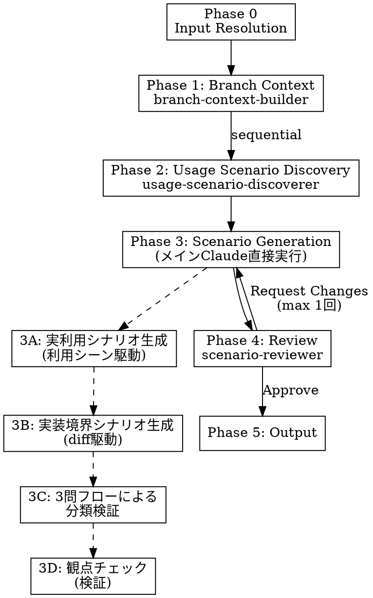

# Scenario Test from Sessions

Claude Codeのセッション履歴・設計書・git履歴を分析し、「実利用での壊れにくさ」を検証するシナリオベーステスト仕様書を自動生成する。

普通のテストは機能の正しさを見る。このスキルは壊れにくさを見る。決済機能で言えば、普通のテストは「決済できるか」を見る。このスキルは「実際の使われ方の中でも決済フローが壊れないか」を見る。

## When to Use

- ブランチの実装が一段落し、実利用で壊れそうなポイントを洗い出したいとき
- セッション中に議論・発見されたリスクを仕様書として残したいとき

## When NOT to Use

- 単体テストの生成 / コードの静的解析 / セッションが存在しないブランチ

## カスタムサブエージェント

`~/.claude/agents/` に配置すること（セッション起動時に自動読み込みされる。セッション途中で追加した場合は `/agents` でリロードするか、新しいセッションを開始すること）:

| サブエージェント | 役割 | モデル |
|---|---|---|
| `branch-context-builder` | git履歴・セッションログ・設計書からブランチの進化を統合的に再構築 | opus |
| `usage-scenario-discoverer` | 利用シーン・利用文脈を発見・育てる | opus |
| `scenario-reviewer` | シナリオ仕様書を時間的境界を守ってレビュー | opus |

## Core Flow



**Phase 1はgit履歴・セッションログ・設計書を統合的に分析する。Phase 2はPhase 1の出力に依存するため、Phase 1完了後に起動する。**

**重要: Bashスクリプト内の変数は、あなたがコンテキスト上の値で置き換えて実行すること。Bashツールは呼び出しごとに独立シェルで実行されるため、変数は自動的には引き継がれない。**

---

## Phase 0: Input Resolution

### Step A: プロジェクトとブランチの特定

以下を1つのBash呼び出しで実行し、PROJECT_ROOT、SESSION_BASE、現在のブランチ、ブランチ候補を一括取得する:

```bash
PROJECT_ROOT=$(git rev-parse --show-toplevel 2>/dev/null)
ENCODED=$(echo "$PROJECT_ROOT" | sed 's|/|-|g')
SESSION_BASE="$HOME/.claude/projects/${ENCODED}"
echo "PROJECT_ROOT: $PROJECT_ROOT"
[ -d "$SESSION_BASE" ] && echo "SESSION_BASE: $SESSION_BASE" || echo "NO_SESSIONS"
BRANCH=$(git branch --show-current 2>/dev/null)
echo "CURRENT_BRANCH: $BRANCH"
echo ""
echo "=== Recent branches (by session activity) ==="
for branch in $(grep -oh '"gitBranch":"[^"]*"' "$SESSION_BASE"/*.jsonl 2>/dev/null | sort -u | sed 's/"gitBranch":"//;s/"//'); do
  count=0
  latest=0
  for s in "$SESSION_BASE"/*.jsonl; do
    [ -f "$s" ] && grep -qF "\"gitBranch\":\"${branch}\"" "$s" 2>/dev/null && {
      count=$((count+1))
      ts=$(stat -f %m "$s" 2>/dev/null || stat -c %Y "$s" 2>/dev/null)
      [ "$ts" -gt "$latest" ] && latest=$ts
    }
  done
  echo "$latest $count $branch"
done | sort -rn | head -5 | while read ts count branch; do
  echo "$count session(s) — $branch"
done
```

**出力された PROJECT_ROOT、SESSION_BASE、TARGET_BRANCH（ユーザーが選択したブランチ）の値を記録し、以降の全Phaseで使用する。**

現在のブランチがリストに含まれていればそれをデフォルトとして提示する。ユーザーが選択または承認するまで先に進まない（最大1往復）。

### Step B: プロジェクトコンテキスト収集

CLAUDE.mdはシステムコンテキストに含まれているため再読み込みしない。`README.md` と、以下のうち存在するビルドシステム/プロジェクト定義ファイルをReadツールで読み込む:

| 言語/エコシステム | ファイル |
|---|---|
| JavaScript/TypeScript | `package.json`, `tsconfig.json` |
| Python | `pyproject.toml`, `setup.py`, `setup.cfg` |
| Rust | `Cargo.toml` |
| Go | `go.mod` |
| Java/Kotlin | `build.gradle`, `build.gradle.kts`, `pom.xml` |
| Ruby | `Gemfile` |
| C#/.NET | `*.csproj`, `*.sln` |
| Elixir | `mix.exs` |
| PHP | `composer.json` |
| Swift | `Package.swift` |

全て探す必要はない。Globツールで `{package.json,pyproject.toml,Cargo.toml,go.mod,build.gradle*,pom.xml,Gemfile,*.csproj,mix.exs,composer.json,Package.swift}` を実行し、見つかったものだけを読む。

**モノレポの場合の注意:**
プロジェクトがモノレポ構成（`packages/`、`apps/` 等の複数パッケージを含む）の場合:
- TARGET_BRANCHの変更が**どのパッケージに閉じているか**を確認する（`git diff main...{TARGET_BRANCH} --name-only` の出力パスで判断）
- 変更が単一パッケージに閉じている場合は、そのパッケージのREADME.mdとpackage.jsonを優先的に読み込む
- 変更が複数パッケージにまたがる場合は、パッケージ間の依存関係（各package.jsonのdependencies）を確認し、影響範囲を特定する
- 利用シーンの発見は変更パッケージの公開APIを起点とする。内部パッケージ（private: true）の変更は、それを利用する公開パッケージ経由でシーンを導出する

**現在の制限**: 本スキルはモノレポのパッケージ境界を自動認識しない。上記の判断はスキル実行者（メインClaude）が手動で行う。

---

## Phase 1: Branch Context（サブエージェント）

Agentツールで `branch-context-builder` サブエージェントを起動する。Phase 0で得た PROJECT_ROOT、TARGET_BRANCH、SESSION_BASE の値を埋め込むこと:

```
subagent_type: "branch-context-builder"
prompt: |
  PROJECT_ROOT: （Phase 0で得た値）
  TARGET_BRANCH: （Phase 0で得た値）
  SESSION_BASE: （Phase 0で得た値）
  ブランチの進化ドキュメントを構築してください。
```

サブエージェントはgit履歴・セッションログ・設計書を統合的に分析し、`/tmp/branch-evolution.md` を出力する。完了後にReadツールで読み込む。

---

## Phase 2: Usage Scenario Discovery（Phase 1完了後に起動）

Phase 1の `/tmp/branch-evolution.md` が完成してから起動する。

Agentツールで `usage-scenario-discoverer` サブエージェントを起動する:

```
subagent_type: "usage-scenario-discoverer"
prompt: |
  PROJECT_ROOT: {value}
  TARGET_BRANCH: {value}
  ブランチ進化ドキュメント: /tmp/branch-evolution.md を読み込んでください。
```

サブエージェントは `docs/test-scenarios/usage-scenarios.md` を差分更新する。完了後にReadツールで読み込む。

**注意**: discovererにはSESSION_BASEを渡さない。discovererはセッションログを直接読まず、`/tmp/branch-evolution.md` 経由でブランチ情報を取得する。

---

## Phase 3: Scenario Generation

**メインClaudeが直接実行する。サブエージェントには委譲しない。**

**入力**: `/tmp/branch-evolution.md`（Phase 1の出力）と `docs/test-scenarios/usage-scenarios.md`（Phase 2の出力）を基にシナリオを導出する。コードの詳細な変更内容が必要な場合は、`git show <commit>` や `git diff` で必要なファイルのdiffを個別に取得してよい。ただし `/tmp/branch-evolution.md` の情報で判断可能な場合はそれを優先する。

### 禁止事項（厳守）

1. **ブランチ範囲外の機能を前提とするシナリオの生成は禁止。** `/tmp/branch-evolution.md` の「存在しない機能（ブランチ範囲外）」に記載された機能はテスト対象外。
2. **根拠なきシナリオ禁止。** Phase 0-2の情報源に根拠がないものは不可。
3. **曖昧な期待値禁止。** 「正しく動作する」は不可。観測可能な結果を書け。
4. **「望ましい」「すべき」の混入禁止。** 期待値は現在の実装で観測可能な挙動のみ。未実装機能への要求を書いてはならない。

### Phase 3A: 実利用シナリオの生成（利用シーン駆動）

**思考の方向: 「利用シーン → 壊れるパターンを探す」。** diffからの逆引きではなく、利用シーンの正常フローを起点として壊れ方を発見する。

- **入力**: 利用シーン + 壊れやすさヒント + ユーザー影響マップ + 乖離一覧
- **思考フロー**:
  1. 各利用シーンの正常フローを想像する
  2. 壊れやすさヒントが指摘する箇所に注目し、ブランチの変更が触れているか確認
  3. 触れている場合、ユーザー視点のギャップをUSフィールドで記述
  4. 触れていない場合でも、計画vs実装の乖離がフローに影響するか確認
  5. 利用文脈のバリエーション下でも正常フローが成立するか検証

横断レンズ（計画と実装の乖離）もこのフェーズで適用する。`/tmp/branch-evolution.md` の「計画 vs 実装の乖離一覧」の各項目を利用シーンと掛け合わせる:

| パターン | 着眼点 |
|---|---|
| 計画からの方針転換 | 「残す」「段階的に移行」が「完全削除」になった箇所。失われた安全網がリスクを生むか |
| 計画外の追加機能 | 設計レビューを経ていないためエラーハンドリングが不十分な可能性 |
| 修正コミットの背景 | fix/refactorは「設計時の想定ミス」。同様のミスが他にないか |
| 先送りされた議論 | 理由が解消されていなければリスクとして残る |

- **出力**: US01, US02, ...

### Phase 3B: 実装境界シナリオの生成（diff駆動）

コミットdiffから境界条件・エッジケースを直接導出する。実装の判断が揺らぐ入力パターンや状態遷移に特化する。

- **入力**: コミットdiff + 変更ファイル一覧
- **思考フロー**:
  1. 各変更箇所の境界条件を特定
  2. エラーハンドリングの穴を探索
  3. 既存の前提を壊す変更を検出
  4. IBフィールドで記述
- **出力**: IB01, IB02, ...

### Phase 3C: 3問フローによる分類検証（新規）

Phase 3Aと3Bで生成されたシナリオを3問フローで検証し、分類の再確認・再分類を行う。

```
Q1: このシナリオが検証する状況は、ユーザーが通常の利用で遭遇する可能性が高いか？
    |-- Yes --> 実利用シナリオ (US)
    |-- No
        Q2: このシナリオの前提条件を成立させるには、意図的な入力構成やタイミング操作が必要か？
            |-- Yes --> 実装境界シナリオ (IB)
            |-- No
                Q3: このシナリオが失敗した場合、ユーザーの主要タスクが完遂できなくなるか？
                    |-- Yes --> 実利用シナリオ (US)
                    |-- No --> 実装境界シナリオ (IB)
```

- 3Aで生成されたシナリオが実はIBだった場合 → 再分類またはUS/IB分割
- 3Bで生成されたシナリオが実はUSだった場合 → USに再分類し「ユーザーの状況/意図」を追記

### Phase 3D: 観点チェック（検証）

Phase 3A・3B・3Cの出力に対して、以下の6観点で**漏れがないか再検討**する。空欄があっても問題ではない。空欄は「本当にリスクがないか意図的に再検討する」トリガーとしてのみ機能する。

**注意**: 追加シナリオには3問フローで分類（US/IB）を付与する。

| 観点 | 問い | 補助 |
|---|---|---|
| 通常利用の落とし穴 | 普通に使っていて踏む地雷は？ | 2回目以降や順序を変えても同じ結果になるか？ |
| 雑な操作・並行操作 | 雑に操作したらどこが壊れる？ | 想定外のタイミングや中断で状態が壊れないか？ |
| 環境変動 | ネットワーク/OS変化でどう壊れる？ | 処理中に環境が変わったら？ |
| 外部依存の断絶 | 依存サービスが壊れたら？ | 部分的な障害（遅延・不完全な応答）ではどうなる？ |
| 時間経過・蓄積 | 長時間/大量利用で何が劣化する？ | リソースの解放漏れや上限到達時の振る舞いは？ |
| 復旧・リカバリ | 壊れた後、正常状態に戻れるか？ | ユーザーが修復する手順は明確で、実行可能か？ |

### 導出根拠のルール

各シナリオに以下のいずれかを明記:
- a) 設計書・計画書の具体的な記載（計画 vs 実装の乖離を含む）
- b) セッション内の具体的な議論・発見
- c) ブランチのコミットdiffからの論理的導出
- d) 利用シーンとブランチ変更の掛け合わせ
- e) 利用文脈とブランチ変更の掛け合わせ

「一般的に問題になることが多い」のような汎用理由は不可。

### 出力フォーマット

```markdown
# シナリオベーステスト仕様書

## メタ情報
| 項目 | 値 |
|---|---|
| プロジェクト | {project_name} |
| ブランチ | {branch_name} |
| 生成日時 | {datetime} |
| ブランチ時間範囲 | {start} ~ {end} |
| 対象セッション数 | {n} |
| 設計書・計画書 | {paths} |
| 利用シーン数 | {n} |
| 生成シナリオ数 | 実利用: {n} / 実装境界: {n} / 合計: {n} |

## プロジェクト概要
{200-400字}

## ブランチ進化サマリ
{/tmp/branch-evolution.md を転記}

## 利用シーン
{docs/test-scenarios/usage-scenarios.md から、ブランチに関連するシーンを転記}

## セッションから読み取れた主要な議論
{箇条書き}

---

## 実利用シナリオ

### US01: {タイトル}
- **利用シーン**: {usage-scenarios.mdのシーン名で参照}
- **ユーザーの状況**: {ユーザーがどんな状態にあるか}
- **ユーザーの意図**: {ユーザーが何を達成しようとしているか}
- **前提**: {テスト開始時の状態}
- **操作**: {ユーザーが行う具体的な操作ステップ}
- **期待**: {ユーザーが観測できる結果。コード行番号への参照は不要}
- **導出根拠**: {具体的参照}

---

## 実装境界シナリオ

> 以下は実装の境界条件を突くシナリオです。
> 対応するかどうかは開発者の判断に委ねます。

#### IB01: {タイトル}
- **対象コード箇所**: {ファイル名:行番号、関数名}
- **境界条件**: {どのような入力・状態がこの境界を突くか}
- **発生する挙動**: {境界条件に遭遇した場合に実際に何が起きるか}
- **影響度**: {ユーザーへの影響}
- **利用シーン**: {どの利用シーンの文脈で発生しうるか}（任意）
- **導出根拠**: {コミットdiff、セッション議論など}
- **補足**: {対応案のヒント、発生頻度の見積もりなど}（任意）

---

## 導出根拠サマリ
| # | カテゴリ | シナリオ | 利用シーン/文脈 | 根拠カテゴリ | 情報源 |
|---|---|---|---|---|---|

## レビュー結果
{Phase 4の結果}
```

---

## Phase 4: Review（サブエージェント）

Phase 3の出力を `/tmp/scenario-skill-draft.md` にWriteツールで書き出す。

Agentツールで `scenario-reviewer` サブエージェントを起動する:

```
subagent_type: "scenario-reviewer"
prompt: |
  シナリオベーステスト仕様書のドラフトをレビューしてください。
  ドラフトは `/tmp/scenario-skill-draft.md` に書き出してあります。Readツールで読み込んでください。

  以下はレビューの参照情報です。

  ## プロジェクト概要
  {Phase 0 Step Bで読み込んだREADME.md + package.json等の要約}

  ## ブランチ進化サマリ
  {/tmp/branch-evolution.md の全文。「存在しない機能（ブランチ範囲外）」セクションを必ず含む}

  ## 利用シーン
  {docs/test-scenarios/usage-scenarios.md の「確定シーン」+「仮説シーン」部分}

  ## 利用文脈カタログ
  {docs/test-scenarios/usage-scenarios.md の「利用文脈カタログ」部分。存在しない場合は省略}

  ## セッションの主要な議論
  {/tmp/branch-evolution.md の「セッションから読み取れた主要な議論・発見」セクション}
```

```
Approve → Phase 5へ
Request Changes → Critical修正 + Missing追加 → 再レビュー（軽量: Critical解消確認のみ）
2回目もRequest Changes → 打ち切り、未解決事項を記録してPhase 5へ
```

---

## Phase 5: Output

```bash
mkdir -p docs/test-scenarios && echo "dir ready"
```

Writeツールで `{PROJECT_ROOT}/docs/test-scenarios/{BRANCH_SLUG}_{YYYYMMDD}.md` に書き出す。BRANCH_SLUGはブランチ名のスラッシュをハイフンに置換したもの（例: `feat/file-reference-buttons` → `feat-file-reference-buttons`）。

ユーザーへの報告: 生成ファイルパス、シナリオ数（実利用/実装境界の内訳）、利用シーンカバレッジ、計画vs実装の乖離から導出されたシナリオ、特に注目すべきシナリオ。

---

## Red Flags -- STOP

以下に該当する場合は停止し、ユーザーに確認:

- セッション0件 → ブランチ名確認
- セッション10件以上 → 全件処理するか確認
- 設計書・計画書が0件 → セッション依存度が高くなる旨を告知
- マージ済みブランチでマージコミットが見つからない → 代替手段を検討
- カスタムサブエージェントが認識されない → `/agents` でリロードを試みる。それでも認識されない場合は、`~/.claude/agents/` のファイルを確認し、general-purposeエージェントにサブエージェント定義の全文をpromptに埋め込んで代替実行する
